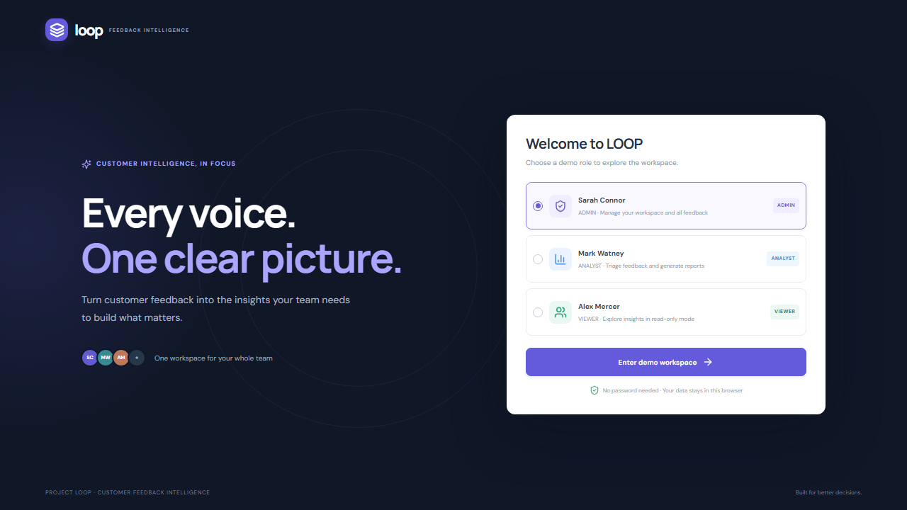
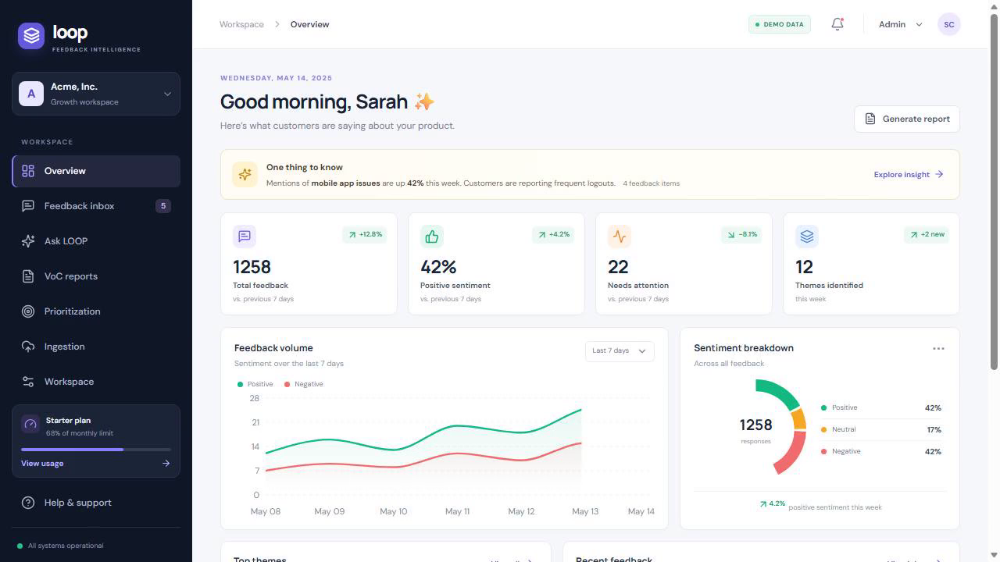
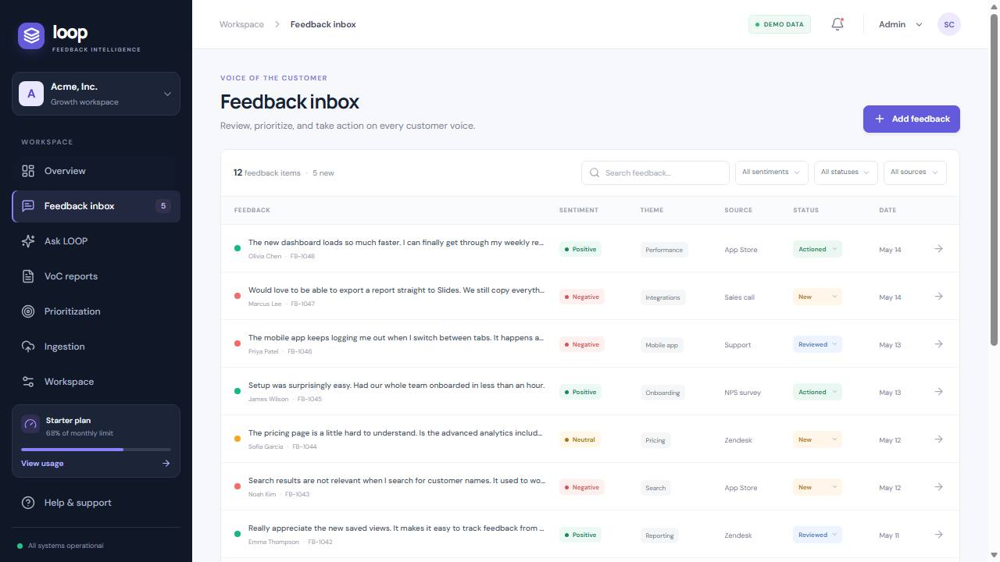
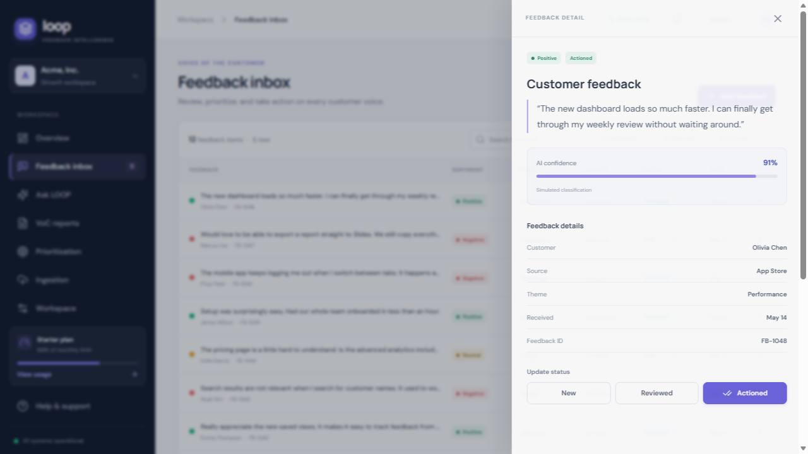
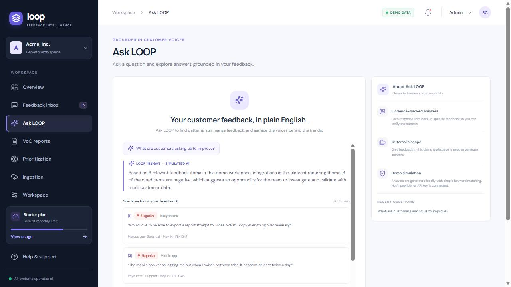
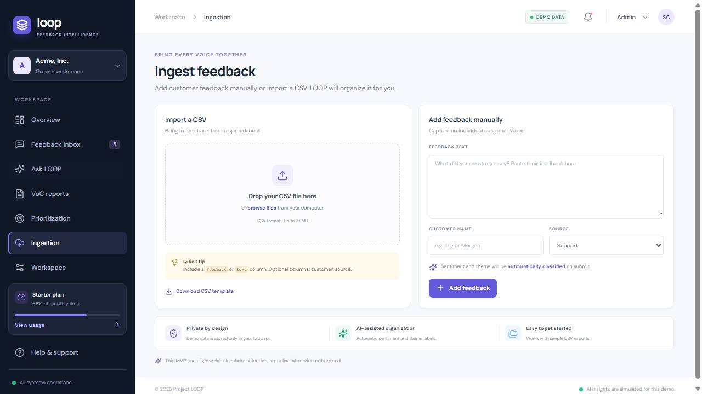
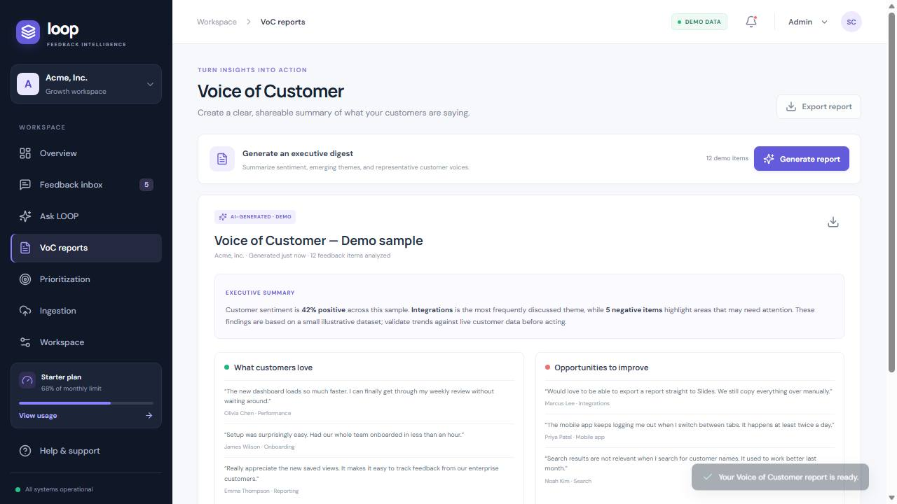
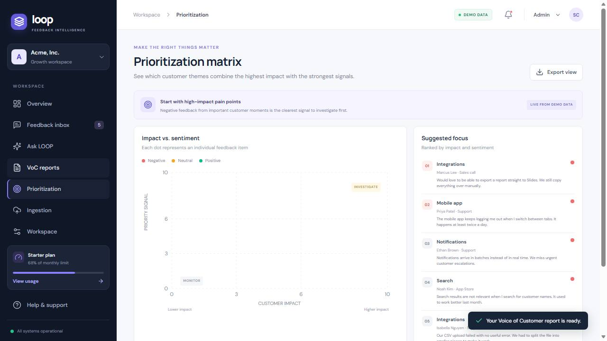

# Project LOOP

**Customer feedback intelligence, in focus.** Project LOOP is a responsive React demo that brings multi-channel customer feedback into one workspace, highlights sentiment and themes, and helps teams explore evidence-backed product opportunities.

> **MVP scope:** This is a frontend-only demo backed by sample data and browser `localStorage`. AI classification, Ask LOOP answers, and report generation are explicitly simulated. No account credentials, external AI service, API key, or production backend is required or included.

## Live demo and walkthrough

- **Live demo:** [Project LOOP on Vercel](https://temporary-snappy-drizzle-easpqly.vercel.app/)
- **Demo video:** [Watch or download the 28-second walkthrough](docs/media/project-loop-demo.mp4)
- **Project report:** [Read the verification and delivery report](docs/PROJECT-REPORT.md)

The Vercel project is connected to this GitHub repository. The `main` production deployment was verified on September 27, 2026. Use the project-domain link above; Vercel's deployment-specific URL may require an authenticated project session.

## Demo

Select a role on the welcome screen. No password is needed. Switch roles at any time from the top-right role selector.

| Role | Demo user | Email | Access |
| --- | --- | --- | --- |
| **ADMIN** | Sarah Connor | `sarah.admin@acme.com` | All views, ingestion, triage, workspace demo users |
| **ANALYST** | Mark Watney | `mark.analyst@acme.com` | Ingestion, triage, reports, insights |
| **VIEWER** | Alex Mercer | `alex.viewer@acme.com` | Read-only access to feedback and insights |

These names and email addresses identify local demo personas only; there is no password or real authentication.

## Features

- **Overview dashboard:** KPI cards, sentiment distribution, feedback trend, top themes, recent customer voices, and a highlighted emerging issue.
- **Feedback inbox:** Search by feedback, customer, theme, or ID; filter by sentiment, status, and source; inspect details and classification confidence; update triage status when permitted.
- **Ingestion:** Add individual feedback with a source and optional customer name, or import CSV files with a `feedback`/`text`/`comment` column and optional `customer` and `source` columns. A downloadable CSV template is included.
- **Ask LOOP:** Try suggested questions or ask your own. The demo responds with local keyword matching and citations to relevant sample or locally added feedback.
- **Voice of Customer reports:** Generate an executive-style sentiment and theme digest with representative feedback quotes; export it as a plain-text report.
- **Prioritization matrix:** Explore feedback by illustrative customer impact and sentiment, with a ranked focus list and feedback detail links.
- **Role-based demo UX:** Admin, analyst, and viewer permissions control navigation, ingestion, and status changes. This is a UI demonstration, not server-side security.
- **Responsive layout:** Desktop dashboard and mobile navigation, with no real backend required.

The sample dashboard includes illustrative aggregate metrics to make the demo feel populated. Inbox items and any feedback you add are local demo records; displayed trends and prioritization scores are not live analytics.

## Technology

- React 18 + TypeScript + Vite
- Tailwind CSS configuration and custom responsive design tokens/styles
- Lucide React icons
- Recharts visualizations
- ESLint flat config

## Local setup

Prerequisites: Node.js 18 or newer and npm.

```bash
npm install
npm run dev
```

Open the local URL printed by Vite (normally <http://localhost:5173>).

### Checks and production preview

```bash
npm run lint
npm run build
npm run preview
```

The production bundle is written to `dist/`. No `.env` file is needed. Do not add real credentials to frontend environment variables: values prefixed with `VITE_` are bundled into client-side code and are not secret.

## Deployment

The static Vite build can be hosted by Vercel, Netlify, GitHub Pages (with the appropriate Vite `base` setting for a project subpath), or any static web host:

1. Connect the repository to your hosting provider.
2. Use `npm run build` as the build command.
3. Publish the `dist` directory.

For Vercel CLI, run `npx vercel` in the repository and follow its prompts. The demo has no API server, database, authentication service, or AI provider; deployment publishes the frontend only. User-added feedback is saved in browser-local storage and is not shared across browsers or users.

## Screenshots

Screenshots are captured from the working demo at 1280 × 720. Sample data is used throughout.

| Welcome | Overview |
| --- | --- |
|  |  |

| Feedback inbox | Feedback detail |
| --- | --- |
|  |  |

| Ask LOOP | Feedback ingestion |
| --- | --- |
|  |  |

| Voice of Customer report | Prioritization matrix |
| --- | --- |
|  |  |

## Project structure

```text
src/
  App.tsx       Demo login, application shell, screens, and interactions
  data.ts       Demo personas, sample feedback, and local classifier
  main.tsx      React entry point
  styles.css    Responsive application styling
```

## Current limitations

- Role-based access is client-side and intended only to demonstrate user flows; it is not authorization for a real multi-tenant service.
- AI labels and answers use local heuristic matching. Citations are selected from the browser's demo feedback data, not a vector database or external model.
- CSV support is intentionally simple and designed for small, ordinary CSV exports; it is not a robust ETL pipeline.
- Data persistence is local to the browser. Clearing site data resets the demo to its sample state.
- No live webhook, support-platform connector, team management, or secrets management is configured.

## License

See [LICENSE](LICENSE).
