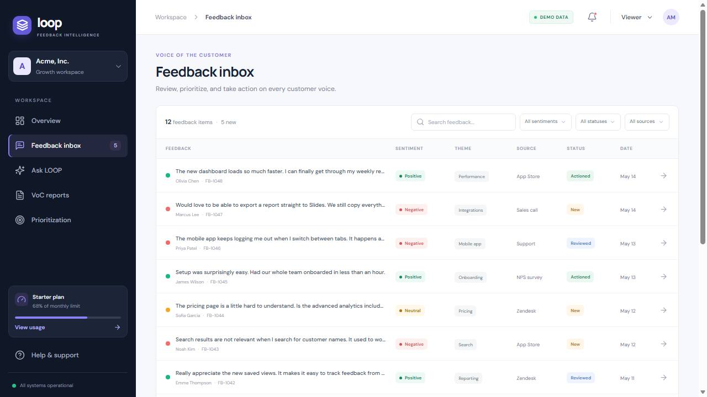

# Project LOOP - Demo and Deployment Report

**Report date:** September 27, 2026
**Repository:** [mmeenakshibio2016-byte/Project-LOOP](https://github.com/mmeenakshibio2016-byte/Project-LOOP)
**Production demo:** [temporary-snappy-drizzle-easpqly.vercel.app](https://temporary-snappy-drizzle-easpqly.vercel.app/)
**Downloads:** [Formatted report (PDF)](PROJECT-REPORT.pdf) | [Submission bundle (ZIP)](media/project-loop-submission.zip)
**Walkthrough:** [Download the demo video with original music and sound effects (MP4, 1280 x 720)](media/project-loop-demo-with-sound.mp4)

**Direct public downloads:** [PDF](https://raw.githubusercontent.com/mmeenakshibio2016-byte/Project-LOOP/mmeenakshibio2016-byte-build-loop-mvp/docs/PROJECT-REPORT.pdf) | [Sound-enhanced MP4](https://raw.githubusercontent.com/mmeenakshibio2016-byte/Project-LOOP/mmeenakshibio2016-byte-build-loop-mvp/docs/media/project-loop-demo-with-sound.mp4) | [Submission ZIP](https://raw.githubusercontent.com/mmeenakshibio2016-byte/Project-LOOP/mmeenakshibio2016-byte-build-loop-mvp/docs/media/project-loop-submission.zip)

## Executive summary

Project LOOP is a responsive, browser-based customer feedback intelligence MVP. It demonstrates how a product team can review feedback from several channels, understand sentiment and themes, investigate representative customer voices, and turn those signals into a report or prioritized follow-up.

The merged app is deployed to Vercel from the `main` branch. The public project-domain URL and its static app assets returned HTTP 200 during verification. A production deployment for the current `main` commit completed successfully in the Vercel dashboard. The GitHub repository is connected to the Vercel project for subsequent deployments.

## Delivered demo capabilities

- Role selector for **ADMIN**, **ANALYST**, and **VIEWER** personas.
- Overview dashboard with feedback KPIs, sentiment and volume charts, emerging insight, leading themes, and recent feedback.
- Feedback inbox with search, sentiment/status/source filters, detail panel, simulated classification confidence, and permitted status changes.
- Manual feedback entry and CSV import, saved in browser-local storage.
- Ask LOOP sample questions with citations selected from the local demo feedback.
- Voice-of-Customer digest with representative quotes and plain-text export.
- Sentiment-versus-impact prioritization chart with a suggested focus list.
- Responsive navigation and an admin workspace page.

## Demo video and screenshots

The walkthrough is a screen recording of the running React application with an original, softly mixed electronic music bed and subtle interface-style transition accents. It covers the dashboard, feedback inbox and detail, Ask LOOP, ingestion, report generation, the prioritization matrix, and viewer-mode inbox. It begins with the role-selector screen.

| Screen | Capture |
| --- | --- |
| Role selector |  |
| Overview dashboard |  |
| Feedback inbox |  |
| Feedback detail |  |
| Ask LOOP |  |
| Ingestion |  |
| VoC report |  |
| Prioritization |  |
| Viewer mode |  |

## Verification performed

- `npm install` completed with zero reported vulnerabilities.
- `npm run lint` passed.
- `npm run build` passed TypeScript checking and generated the Vite production bundle.
- The local app and transformed React modules returned HTTP 200.
- Hosted project URL and production static assets returned HTTP 200.
- Walkthrough smoke-tested: role selection, dashboard, inbox, feedback detail and status, cited Q&A, manual ingestion, report generation, prioritization, and viewer read-only navigation.
- The local browser state was reset after the walkthrough so the sample dataset is restored.

## Deployment notes

- **Provider:** Vercel.
- **Source:** GitHub repository `mmeenakshibio2016-byte/Project-LOOP`.
- **Production branch:** `main`.
- **Public project URL:** <https://temporary-snappy-drizzle-easpqly.vercel.app/>.
- **Deployment-specific URLs:** Current Vercel project protection may require signing in to access a deployment-specific URL; use the project-domain URL for the public demo.
- **Hosting scope:** Static frontend only. No server, database, persistent shared feedback store, or live AI provider is configured.

The Vercel-generated project-domain name is not a custom branded domain and can be changed in project settings.

## Known limitations

- Role controls are client-side demo behavior, not secure server-side authorization.
- Sentiment and themes use lightweight local keyword heuristics.
- Ask LOOP uses keyword matching over local items; its answers and citations are illustrative, not generated by a live language model or retrieval service.
- Dashboard aggregate metrics and prioritization scores are sample/demo values, not live analytics.
- Feedback entered in the app persists only in that browser's local storage.
- CSV parsing targets ordinary, small exports and is not a production ETL pipeline.
- Vercel deployment protection may affect generated deployment-specific URLs; the project-domain URL is the user-facing demo.
